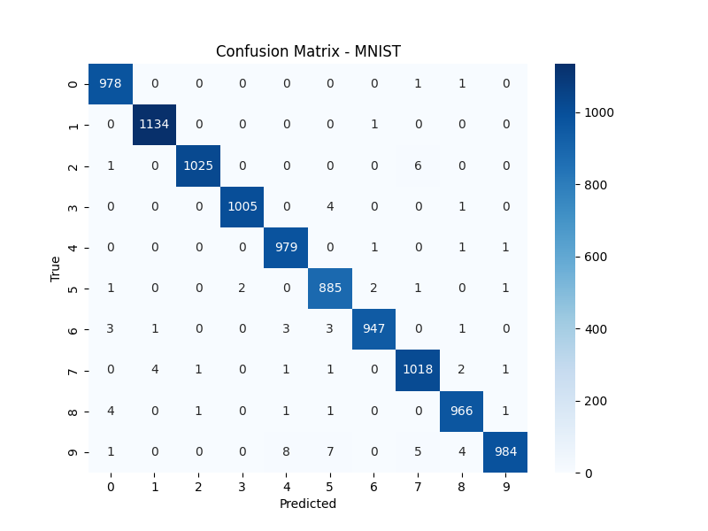

🧠 MNIST Handwritten Digit Classification (CNN)

A clean, industry-style deep learning project for handwritten digit recognition using the MNIST dataset.
This project demonstrates reproducible pipelines, modular design, and professional practices often required in real-world ML/DL roles.

🚀 Features

- Config-driven training (config.yaml) for hyperparameter tuning

- Reproducibility with fixed random seeds

- Modular code structure (data loaders, model, training, evaluation)

- Checkpoint saving (best model only)

- Training + validation split (industry best practice)

- Evaluation metrics: Accuracy, Precision, Recall, F1-score

- Confusion Matrix visualization

- Results stored in results/

---

## 📂 Project Structure

```
mnist_cnn_project/
│── configs/
│   └── config.yaml       # All hyperparameters
│── data/                 # MNIST dataset (auto-downloaded)
│── src/
│   ├── data_loader.py    # Data pipeline
│   ├── model.py          # CNN architecture
│   ├── train.py          # Training script
│   ├── evaluate.py       # Evaluation script
│   └── utils.py          # Reproducibility utils
│── checkpoints/          # Saved best models
│── results/              # Confusion matrix, metrics
│── README.md             # Project documentation

````
📊 Results

- Test Accuracy: 99.2%
- 
---

⚙️ How to Run
1️⃣ Setup Environment
```bash
git clone https://github.com/Uthso66/mnist_cnn_project.git
cd mnist_cnn_project
pip install -r requirements.txt

2️⃣ Train Model

python src/train.py

3️⃣ Evaluate Model

python src/evaluate.py

```
🧑‍💻 Tech Stack

- Python 3.10+

- PyTorch

- Torchvision

- scikit-learn

- Matplotlib / Seaborn

- YAML

🔮 Future Improvements

- Add TensorBoard for visualization

- Try deeper CNNs or ResNet variants

- Convert to ONNX / TorchScript for deployment

- Wrap training in Hydra for multi-experiment management
---